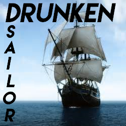

[]

## Hey!
I'm a British Github user, that mainly works on Scratch 3.0 resources with the other LLK contributors!

## Socials 
[Github Profile](https://github.com/Drunken-Sailor7)
[Scratch Profile](https://scratch.mit.edu/users/Drunken_Sailor/)

Markdown is a lightweight and easy-to-use syntax for styling your writing. It includes conventions for

## Who do I work with?
I work with everyone [here](https://github.com/Drunken-Sailor7?tab=following).

